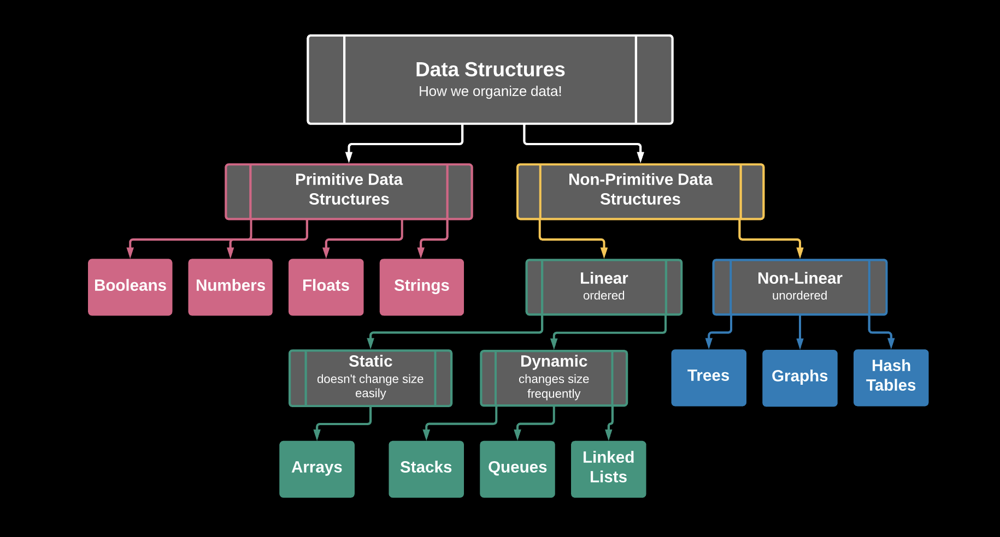

# Algorithms and Data Structures


## Navigation

- [Linked Lists](./data-structures/linked-lists/)
- [Stacks and Queues](./data-structures/stacks-queues/)
- [Hash Tables](./data-structures/hash-tables/)
- [Sets](./data-structures/sets/)
- [Binary Trees](./data-structures/binary-trees/)
- [Graphs](./data-structures/graphs/)

## Overview
A lot of beginners and experienced programmers avoid learning Data Structures and Algorithms because they're complicated and think that there isn't a use for them in real life. As it turns out, we're actually using them all the time! Did you know that under the hood all your React files, MongoDB databases and Linux commands are algorithms and data structures? 

Data structures and algorithms play a major role in implementing software and in the hiring process as well. Many software engineering candidates question why companies’ interviews are focused on DSA instead of language/frameworks/tools specific questions, but there is a method to the madness. Let's get into why that's the case.

When you ask a person to make a decision or solve a problem, ideally they'd tell you:

```jsx
“I chose to do X because it’s better than A, B in these ways."
"I could have gone with C, but I felt this was a better choice because of this.“
```

You'd probably trust an answer like that much more than:

```js
"I went with X. I hope it worked 🤞😅!" 
```

Problems faced by companies hiring software engineers are much harder and at a much larger scale. Software developers have to make the **right decisions** when it comes to solving these problems. 


Important decisions like application architecture, database schemas, and all the rest are where the **engineering** aspects of software development lie. Code implementation should only take up 20-30% of your time on the job, the rest is understanding how and why it should be implemented.

Knowledge of data structures like Hash Tables, Trees, Tries, Graphs, and various algorithms goes a long way in solving these problems efficiently and interviewers are more interested in seeing _how_ candidates use these tools to solve a problem. Just like a car mechanic needs the right tool to fix a car and make it run properly or a painter requires the right type of brush, a programmer needs the right tool (algorithm or data structure) to make software run properly. 

If you know the characteristics of one data structure in contrast to another you will be able to **_make the right decision in choosing the right data structure to solve a problem._** Having a well-informed decision tree is key!


This repo will serve as a starting point for marrying the different concepts of algorithms, data structures, and efficiency with computer science fundamentals, breaking them down into simple parts. As we learn new concepts, the repository will be updated with notes and code for each concept. 

___
## Algorithms
Up to this point in the course, we've covered several algorithms including brute force sorting algorithms, divide and conquer sorting algorithms, search and binary search algorithms, but let's stop first and consider what an algorithm is, since computer science topics often get lost in translation. So, what is an algorithm, really? Simply put:

**An algorithm is a way to process information to reach an end goal.**

That's it! The sorts and searching algorithms we've covered are just that. When you really think about it, even _psuedocode_ is an algorithm, or in other words, a way of processing information to reach an end goal.

```
// My function needs to return a string
//   If this condition is true
//     it will return this kind of string
//   Otherwise
//     it will return this other string
```

Likewise, when you solved problems on sites like [Codewars](https://codewars.com), you were writing _algorithms_ all along! Some algorithms are more efficient than others at reaching their end goals, which is why we as software engineers try to accurately measure their efficiency with metrics like [Big-O Notation](https://github.com/SEI-R-1-25/u2_lesson_big_O).

___
## Data Structures



We've gotten comfortable with some primitive and non-primitive data structures already. Think numbers, booleans, strings, arrays, and objects! Each of these data structures serves a purpose, and is used for specific needs. Likewise as we get into more complex data structures that we'll have to define ourselves to use, they each have a particular use case. Knowing how to implement them is important, but knowing _when_ to use them is the thing that makes us engineers! Let's not worry about the complexity regarding data structures for now. Put simply:

**A data structure is a way of organizing information.**

Think about how you've needed to set up data structures when building applications or solving algorithms. What sort of data structures were needed to create the organization you needed at the time? What were the benefits or consequences of making or not making the right architectural decision?

Complex (Non-Primitive) data structures can generally be split into two main categories: `Linear` and `Non-Linear`. You can think of these categories more simply by thinking of them as either ordered/indexed or unordered data structures. What are some examples of `Linear` and `Non-Linear` data structures that we've already used with JavaScript?

<details><summary>Hint</summary>

  - `[]`
  - `{}`

</details>

Let's think about the sort of use cases we have for objects and arrays. 
- When would an array be a better option than an object?
- When would the key value store of an object be more practical than an array?

We'll be covering Linked Lists, Stacks and Queues, Hash Tables, Sets, Binary Search Trees, and Graphs in more detail, but for now let's try out making some architectural decisions!

___
## Exercise


Take 5 minutes to get a look at the data structures above.

Once you've finished, let's see if we can make some informed guesses about which of these data structures would be most useful and why for these scenarios:
- Modeling a can of Pringles
- Storing the flight information for passengers on a plane once they've been seated and updating their locations when they arrive at their destination.
- Creating a system for organizing where books should be found in a library
- A system for tracking artists that have been booked for a music festival
- Sorting a collection of plants by their heights

___
## Big-O
One last thing before we move on. Let's take a look at some of the Big-O time and space complexities for different data structures. From this, we can also get a better idea about when certain data structures should be used over others.

- What are the best structures for accessing data?
- How about inserting and deleting data?
- What might we use if being able to search through data quickly is important?

Link to the [Big-O Lesson](https://github.com/SEI-R-1-25/u2_lesson_big_O) if you'd like a refresher.


