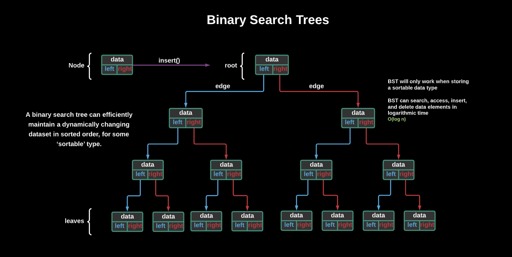

# Binary Search Trees

Binary Trees are sorts of data structures that have numerous employments. They can be applied in search, 3D computer games, high-bandwidth network switches, some shared projects and cryptography. 

A binary search tree can efficiently maintain a dynamically changing dataset in sorted order, for some ‘sortable’ type.

- Each “node” in a BST is actually another BST with 0, 1, or 2 children nodes, and they have the same methods available to them as any BST
- Addition of a new node is based on its value in relation to the nodes in the tree, and follows a specific rule (smaller or equal values go left, and bigger values go right)

A binary tree is a species of tree with one defining feature: Each node has at most two branches.

Each node, except for the root, will have three properties:

- The `value`, which describes the data in the node.
- The `left` property, which points to a node with a lesser value than the current node.
- The `right` property, which points to a node with greater value than the current node.
- The left and right properties can also be set to `null` if the node has no child elements.

As we add new nodes to the binary tree, we use this logic to find each new node’s proper place in the structure: lesser values go left; greater values go right. (Remember this hint: lesser = left!)

___
## Traversing a Binary Tree
When you search for a node, insert a new one, or evaluate the size of a tree, you’re `“traversing”` it, which is just a fancy term for checking every node in a tree structure.

There are a couple of ways to accomplish this. You could do it iteratively with a while loop and currentNode pointer to move through the tree until you find what you’re looking for.

You could do it that way, but that wouldn’t be elegant code. Traversing a binary tree means moving along multiple paths in the tree. And the best method for calculating multiple paths or possibilities? Recursion, of course! 

Let's break down two common ways of traversing a binary tree.

Breadth First Search:
- BFS is better for deeper trees since it will take a lot more memory to operate on wider trees.

Depth First Search:
- The opposite applies to DFS — it will take a lot of memory to traverse deeper trees while it works well with wider trees.

___
## Balancing Binary Trees
When we add nodes to a binary tree, we run the risk of it becoming unbalanced (i.e., one side being longer than the other). This makes the tree inefficient. Sad.
- We can rebalance a binary tree by rotating its nodes, but this can be inefficient. Meh.
- Enter the AVL tree: a self-balancing tree that adds nodes efficiently so that it doesn’t become unbalanced. 

## AVL Tree
We’re going to focus on one important type of tree that has realized the self-balancing dream: an AVL tree (named after its inventors, Adelson-Velsky and Landis).

An AVL tree balances itself by automatically calculating the difference in heights — the number of levels — between the left and right sides:

- Difference is 0 or 1: The tree is balanced!
- Difference is more than 1: The tree is unbalanced.

Knowing the height of an AVL tree is important — this is what allows the tree to balance itself!

In many implementations of an AVL tree, the height of a given node is stored as a property within the node itself, just like it stores left and right properties that point to its child nodes.

The height of a given node is the longest possible path forward in the tree before reaching a leaf node (the end of the tree). You can use the setHeight method to do this work for you!

## How an AVL Tree Balances Itself
Let’s get back to fixing the problem of balance with rotation.

Adding a new node to an AVL tree can either keep it balanced or throw it off balance. There are four scenarios for what this imbalance could look like. These can all be resolved with `rotation`, but they involve different steps.

| Scenario | Solution |
| --- | --- |
| Left-left imbalance | Rotate everything to the right. |
| Left-right imbalance | Swap the outer two nodes. Rotate everything to the right. |
| Right-right imbalance | Rotate everything to the left. |
| Right-left imbalance | Swap the outer two nodes. Rotate everything to the left. |

Here's a great tool for visualizing what happens when AVL trees balance themselves.

___
## Big O
Let's take a look at the efficiency of Trees. Notice that there are several types of trees. In this case, we've built a binary search tree:

___
## Code Implementation
Let's take a look at an implementation of a Binary Search tree in `BinarySearchTree.js`

## Resources

- [Building a Binary Search Tree in JavaScript](https://medium.com/@riomartinez/how-to-build-a-binary-search-tree-in-javascript-with-es6-classes-any-why-d14cee13d6f7)
- [USF AVLTree Visualization](https://www.cs.usfca.edu/~galles/visualization/AVLtree.html)

