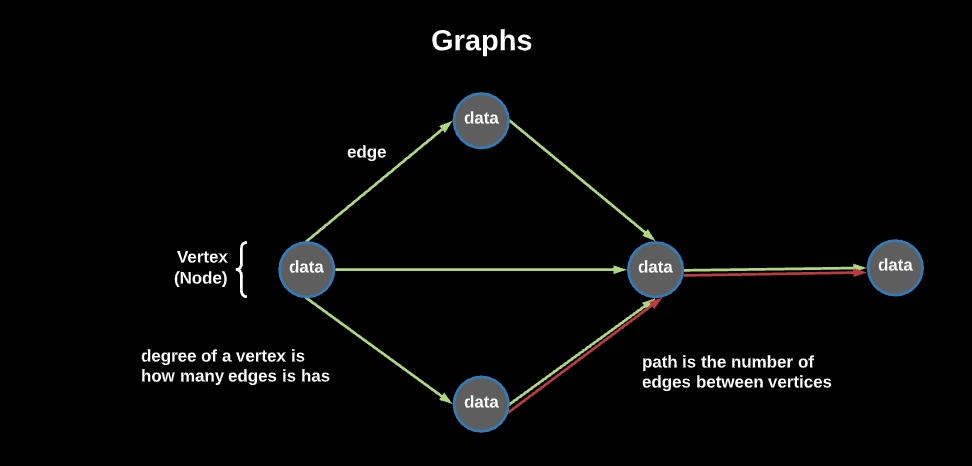

# Graphs



A graph is a collection of nodes, which store data, and edges, which represent relationships or connections between nodes. Nodes in graphs are often called a `vertex`, while the relationships between them are referred to as `edges`.

An edge consists of a pair of vertices. For example, if we establish a pair between two vertices, A and B, we refer to this related pairing as an edge. Because they are _connected by an edge_, A and B are `adjacent`.

Let's break down some of the common terminology associated with graphs:

| Name | Definition |
| --- | --- |
| Vertex | A **node** (some piece of data) stored in the graph |
| Edge | A **connection between two vertices** (nodes) |
| Degree | The number of edges (connections to other nodes) for a vertex (node) |
| Neighbors | All of the vertices (other nodes) that a vertex has edges (connections) to |
| Path | The number of edges between two vertices (nodes) in the graph |

## What Problems Does a Graph Solve?
- `Optimization:` We can use the graph data structure in conjunction with an optimization algorithm for determining an optimal path, such as GPS
- `Network topology:` We can use the graph data structure when modeling network topology, such as the internet or your friends on Facebook!

___
## Two Main Types of Graphs


### Undirected Graphs:
- In an undirected graph, edges are used to form a connection between two nodes, but these edges do not point from one node to another.
- Think of “friending” someone on Facebook: It’s a mutual connection that both parties accept, making it an undirected graph

### Directed Graph:
- In a directed graph, edges have a direction, meaning that they point from one node to another.
- Think of liking someone’s post on Facebook: You’ve established a connection between you and the post, but the connection only points that way.

___
## Representing Graphs
There are also two ways to represent a graph in code: an `adjacency list` and an `adjacency matrix`. At a high level:

- An adjacency list uses a collection of arrays or linked lists for each node.
- An adjacency matrix is represented by a two-dimensional array.

What’s the difference? As per usual, Big O efficiency! (In this instance, we’ll let N represent a node and E represent an edge; both values have an impact on the complexity of adjacency lists and matrices.)

| Operation |	Adjacency List |	Adjacency Matrix |
| --- | --- | --- |
| Lookup | O(N) | O(1) |
| Add a node | O(1) | O(N^2) |
| Remove a node | O(N+E) | O(N^2) |
| Add an edge | O(1) | O(1) |
| Remove an edge | O(E) | O(1) |
| Memory | O(N+E) | O(N^2) |

___
## Adjacency List Representation


An adjacency list is the `more commonly used` graph representation. In an adjacency list, a graph is represented with a collection of arrays or linked lists for each node. 

- A [Map](https://developer.mozilla.org/en-US/docs/Web/JavaScript/Reference/Global_Objects/Map) is commonly used to establish the key value pairs for each node, since they are slightly more efficient than objects.

In code, an adjacency list looks like the example below. Each key-value pair represents a node. The key is the value of the node, and the value is an array of edges to other nodes:

```js
this.adjList = {
  'A': ['B', 'E'],
  'B': ['A', 'C', 'D', 'E'],
  'C': ['B', 'D'],
  'D': ['B', 'C', 'E'],
  'E': ['A', 'B', 'D'],
} 
```

Given that it only stores the edges to other nodes, this graph is an `undirected` graph.

## Adjacency Matrix Representation


In an adjacency matrix, a graph is represented by a two-dimensional array (an array of arrays). Each subarray is a node, and the values in the node represent edges to other nodes. Conceptually, this is what it looks like:

In code, it looks like this, where a 1 represents an edge and a 0 represents a lack of an edge:

```js
this.adjMatrix = [
  [0, 1, 0, 0, 1, 1],
  [1, 0, 0, 0, 1, 0],
  [0, 1, 1, 1, 0, 0],
  [0, 0, 1, 0, 1, 0],
  [1, 1, 1, 0, 0, 0],
] 
```

We won't be focusing on adjacency matrices since they are inefficient when it comes to storing large amounts of data. Adjacency lists are much better at doing this, which is why they are more commonly used.

___
## Traversing a Graph
Once we have our graph, we need some way of traversing it (that is, navigating from one node to the next through the edges between them in order to search, count, or add nodes).

There are two common ways of traversing graphs: breadth-first search and depth-first search. (And yes, these are the same search methods that are used for binary trees!) Let's break down how they work.

## Breadth-First Search
A breadth-first search will visit every node connected to the root node before moving on to the next level of nodes, staying as close to the starting point as possible before moving on to subsequent levels of the graph.

## Depth-First Search
A depth-first search will follow a chain of nodes by their edges down to the bottom of the graph and repeat the process at the root node until the node is found, trying to move as far away as possible from the root node until it reaches a dead end.

___
## Code Implementation
In our example in `AdjLstGraph.js` we have a simple, undirected Adjacency List graph.

## Resources
- [(Video) Reducible: Introduction to Graph Theory](https://youtu.be/LFKZLXVO-Dg)
- [(Video) Reducible: Breadth First Search](https://youtu.be/xlVX7dXLS64)
- [Geeks for Geeks Graph Data Structure](https://www.geeksforgeeks.org/graph-data-structure-and-algorithms/)
- [VisuAlgo Graph Data Structure](https://visualgo.net/en/graphds)
- [Emory Graph Data Structure](http://www.mathcs.emory.edu/~cheung/Courses/171/Syllabus/11-Graph/data-stru.html)
