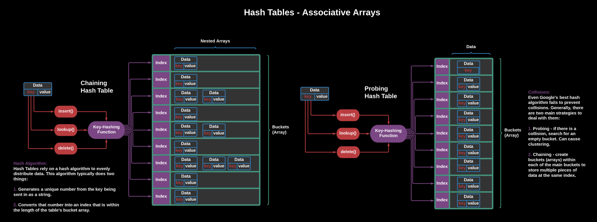

# Hash Tables

A hash table is a data structure that uses a key to sort an index into a table of values.	

Any hash table implementation must include three basic methods:
- search
- insert
- remove

## Hash function	
- Takes a key, scrambles it, and outputs an index to be used in a hash table.

## Collisions 
- When a hash function generates the same index for two different values.

___
## Probing

A resolution for collisions that uses probing (searching for other indices in the table).	

### Linear Probing
If the slot at the hashed index is occupied, look one slot to the right. Keep doing this until an open slot is found.

If the hash function isn’t set up carefully, this can cause what’s known as `clustering`, meaning that keys will be clumped together instead of distributed evenly. This is a problem, because indices are more likely to have to iterate through the cluster to reach an open space as opposed to coming across open spaces scattered neatly throughout the table.

### Quadratic Probing
If the slot at the hashed index is occupied, square the number of steps you take to the right (i.e., take one step, then four, then nine, then 16, then 25, etc.) until you find an open slot.

For example: If index 7 is taken, try 8. If index 8 is taken, try 12. If 12 is taken, try 21, then 37, and so on.

### Double Hashing
Come up with a secondary hash function. It must not ever return 0 and it must be able to return all addresses in the table.

If the slot at first index generated by (hash(x)) is occupied, hash that index using the secondary hash function (e.g., hash2(x)). If that slot is occupied, try 2 * hash2(x), then 3 * hash2(x), and so on.

___
## Chaining 

A resolution for collisions that creates “chains” of other data structures at each index.	

With chaining, each slot in the hash table is built as a bucket that can hold as many keys as you want. 

So, if the hash function generates the same index for two keys, we don’t need to probe around to find an empty slot for them — we just add them to the bucket! Oftentimes, these buckets are implemented as a linked list: a simple data structure that preserves the simplicity of chaining. 

Chaining is the **more elegant and simple** approach to a hash table implementation.

## Differences
The differences between chaining and probing become really clear when we look at how they each accomplish these methods. Everything is so short and clear for chaining!

| Method | Search |  Insertion | Deletion |
| --- | --- | --- | --- |
| Chaining | hash the key, then search the data structure at that index for that key. | hash the key, then store it in the data structure at that index. | hash a key, then delete the data from the data structure located at that index. |
| Probing | hash the key, see if it’s at that index, and probe until you find it or find an empty slot.	 | hash the key, then put it at the index generated; if that index is taken, probe until you find one that’s available. | Essentially a search followed by a deletion, but you must set an indicator that an element was deleted or a probe might stop there when it should keep jumping.	 |
	
___
## Big O
Let's take a look at the efficiency of Hash Tables:

Notice that they perform _very_ well with insertion, deletion, and search!
___
## Code Implementation
Let's take a look at an implementation of a chaining hash table in `HashTable.js`

## Resources
- [VisuAlgo Hash Table](https://visualgo.net/en/hashtable)
- [Data Structures 101: implement hash tables in JavaScript](https://www.educative.io/blog/data-strucutres-hash-table-javascript)
