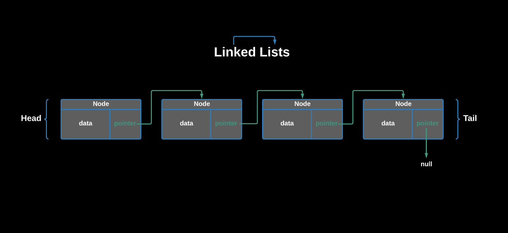

# Linked Lists



## Overview

Like arrays, Linked Lists are linear data structures. Unlike arrays, linked list elements, called `nodes`, are not stored at a contiguous location; the elements are linked using `pointers`, or in other words, references to other nodes. 

You can think of `nodes` as objects containing some sort of `data` and a reference to the `next` node in the list:

```js
class Node {
  constructor(data, next = null) {
    this.data = data;
    this.next = next;
  }
}
```

In simple words, a linked list consists of `nodes` where each node contains a `data` and a `reference` (pointer) to the `next` node in the list. 

Linked Lists always start with a `head` node, where access to the list is found through referencing the `next` references in each new node that is added into the list. They often have a `tail` as well to represent the end of the list in with the tail's `next` reference set as `null`, since nothing should exist past the tail. Here's a quick example of how you might want to set up a Linked List to start:

```js
class LinkedList {
  constructor() {
    this.head = null;
    this.tail = null;
    this.size = 0;
  }
}
```

___
## Why Use A Linked List?
Why not just use an array?

Arrays can be used to store linear data of similar types, but arrays have the following limitations.

- The size of the arrays is fixed: So we must know the upper limit on the number of elements in advance.
- Inserting a new element in an array of elements is expensive because room has to be created for new elements and all existing elements have to be shifted.

For example, if we maintain a sorted list of IDs in an array called `idArray`:

```js
const idArray = [1000, 1010, 1050, 2000, 2040].
```

And if we want to insert a new ID: `1005`, then to maintain the sorted order, we have to move all the elements after 1000 (excluding 1000).

Deletion is also expensive with arrays until unless some special techniques are used. For example, to delete `1010` in our `idArray`, everything _after_ `1010` has to be moved.

___
## Big O
Let's take a look at the efficiency of Linked Lists in comparison with Arrays:


### Advantages Over Arrays
1) Dynamic size
2) Ease of insertion/deletion

### Drawbacks:
1) Random access is not allowed. We have to access elements sequentially starting from the first node. So we cannot do binary search with linked lists as efficiently.
2) Extra memory space for a pointer is required with each element of the list.
3) Not cache friendly. Since array elements are contiguous locations, they are much more accesible than in linked lists.

___
## Code Implementation
A linked list is represented by pointers (a reference or link) with `nodes` from the first node of the linked list.

- The first node is called the `head`. 
- The last node is called the `tail`.
- If the linked list is empty, then the values of both the head and tail are `null`.

Each node in a list consists of at least two parts:
1) `data` - some primitive data, typically numbers
2) Pointer (Or Reference) to the `next` node

Let's take a look at the Linked List we have implemented in `LinkedList.js`

## Resources
- [Linked Lists Geeks For Geeks](https://www.geeksforgeeks.org/data-structures/linked-list/)
- [How to Create a Linked List in JavaScript](https://medium.com/swlh/how-to-create-a-linked-list-in-javascript-1bfef32c7722)

