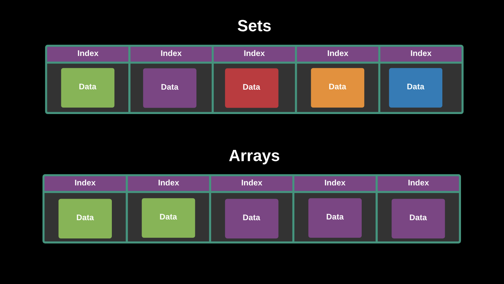

## Sets



A Set is a special type of collection – a “set of values” (without keys), where each value may occur only once. That is, it is a collection of unique values in the Set.

We can add items into a set and iterate them the same as we do in a JavaScript Array. Sets are like Arrays they store a sequence of values but unlike an array, we cannot add duplicates of the same value to a Set, meaning Set can store only unique values


## Creating a Set
With ES6, we can create a set with this syntax:

```js
const mySet = new Set([somearray])
```

## Converting Sets to arrays
Sometimes we may need to convert a set to an array, when we want to filter the values of Set, for example, to be able to use Array.prototype methods like .filter(). In order to do so, we can use `Array.from()`. We can create an Array from a Set using `Array.from` or the spread operator. About Spread operator we will learn more in detail in their respective chapters. Set objects store unique values, so any duplicate elements from an Array are deleted when converting.

## Set Methods
`.add(value)`
- Appends value to the Set object. Returns the Set object with added value.

`.clear()`
- Removes all elements from the Set object.

`.delete(value)`
- Removes the element associated to the value and returns a boolean asserting whether an element was successfully removed or not. Set.prototype.has(value) will return false afterwards.

`.has(value)`
- Returns a boolean asserting whether an element is present with the given value in the Set object or not.

## Code Implementation
Let's take a look at an implementation of sets in `Set.js` 

## Resources
- [MDN Sets](https://developer.mozilla.org/en-US/docs/Web/JavaScript/Reference/Global_Objects/Set)
- [JavaScript Set Data Structure](https://dotnettutorials.net/lesson/javascript-set-data-structure/)
